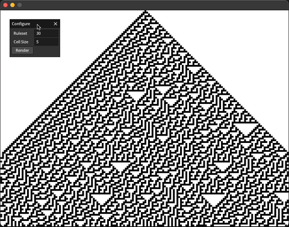

# Elementary Cellular Automata



> All the rules are from the [wolfram's elementary cellular automata ruleset](https://mathworld.wolfram.com/ElementaryCellularAutomaton.html)

## DISCLAIMER

I worked on this project on MacOS (Macbook Air M1), and so the `Makefile` is currently configured to work on my machine. `make` may work on your machine, but I have yet to test on other machines. Contributions are welcomed for those who want the project to work on other OS's.

## Dependencies
- `SDL2`
- `OpenGL`
- [`microui`](https://github.com/rxi/microui)

## Install (MacOS)

```
brew install sdl2
brew install glfw
```

## Compile & Run

```bash
# there is already a executable in the bin you can run
./bin/simulate

# otherwise you may have to compile yourself
make clean ; make
./bin/simulate
```
